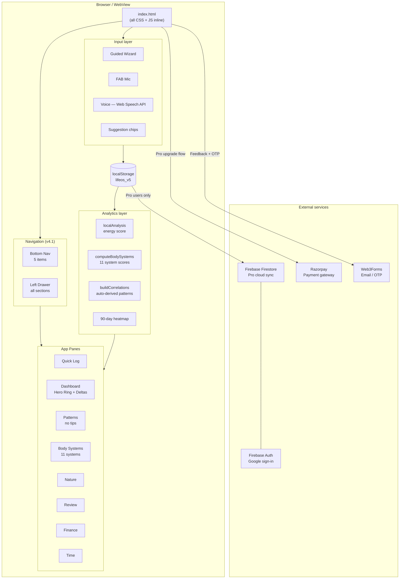
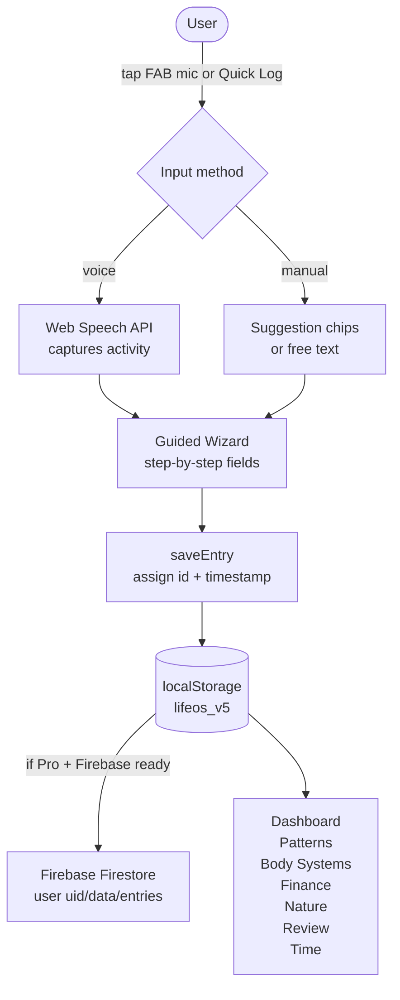
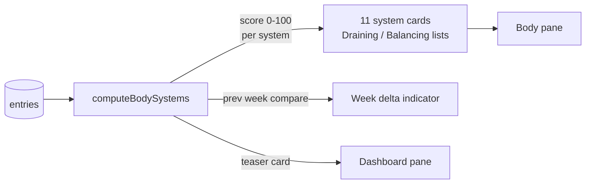
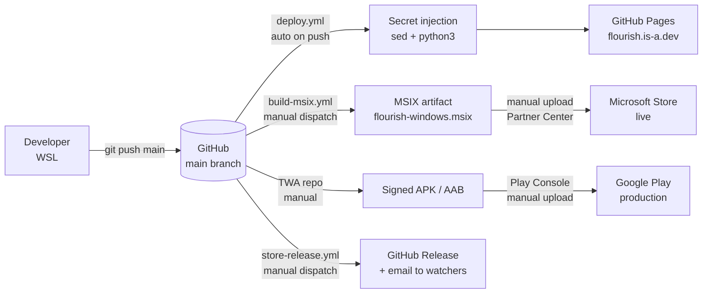

# Flourish — Architecture

## Overview

Flourish is a single-file progressive web app (PWA). There is no framework, no bundler, and no server. Everything — HTML, CSS, and JavaScript — lives in one file (`index.html`). All user data stays on-device in `localStorage` unless the user enables optional Firebase cloud sync via Pro.

---

## Tech stack

| Layer | Technology |
|---|---|
| App | Vanilla HTML / CSS / JS — single file |
| Storage (free) | `localStorage` — key `lifeos_v5` |
| Storage (Pro) | Firebase Firestore v10 (lazy-loaded) |
| Auth (Pro) | Firebase Authentication — Google sign-in |
| Payments | Razorpay (UPI / GPay / cards) |
| Email / OTP | Web3Forms |
| Voice input | Web Speech API (capability-detected at boot) |
| Dark mode | CSS `data-theme="dark"` on `<html>`, persisted in localStorage |
| Hosting | GitHub Pages — `flourish.is-a.dev` |
| CI / CD | GitHub Actions |
| Windows package | MSIX (hand-crafted, `makeappx.exe`) |
| Android package | TWA — signed APK + AAB |

---

## Navigation architecture (v4.1+)

Navigation was redesigned from a horizontal tab bar (7 tabs) to a bottom nav + left drawer pattern:

- **Bottom nav** (5 items): Log · Board · Patterns · Body · More
- **Left drawer** (all sections): Tracking, Insights, Records, Tools (Export, Share Week, Reminder), Settings
- `sw(tab, el)` syncs both bnav buttons and drawer items

This eliminates the mobile antipattern of cramming 7+ items into a horizontal scroll tab bar.

---

## Functional architecture

What the app does from the user's perspective:

```
┌─────────────────────────────────────────────────────────────┐
│                     Flourish PWA                            │
│                                                             │
│  Bottom Nav ─── Log · Board · Patterns · Body · More       │
│  Left Drawer ── Review · Finance · Time · Settings ────    │
│                                                             │
│  ┌──────────┐  ┌───────────┐  ┌──────────┐  ┌──────────┐  │
│  │ Quick Log│  │ Dashboard │  │ Patterns │  │  Body    │  │
│  │          │  │           │  │          │  │ Systems  │  │
│  │ • Wizard │  │ • Hero    │  │ • Cards  │  │          │  │
│  │ • Voice  │  │   Ring    │  │   (data  │  │ • 11     │  │
│  │ • Chips  │  │ • Deltas  │  │   only,  │  │  systems │  │
│  │ • Stories│  │ • KPIs    │  │   no     │  │ • Drain/ │  │
│  └──────────┘  └───────────┘  │   tips)  │  │  Balance │  │
│                               └──────────┘  └──────────┘  │
│                                                             │
│  Drawer ── Review · Finance · Time · Nature · Settings     │
│  Every pane reads from the same local entry store          │
└─────────────────────────────────────────────────────────────┘
```

---

## Technical architecture

### Component diagram



### Data flow — logging an entry



### Body systems data flow



### Deployment pipeline



---

## Data model

Each entry stored as a JSON object in the `lifeos_v5` array:

```js
{
  id,               // timestamp string
  date,             // "YYYY-MM-DD"
  activity,         // free text
  category,         // inferred or chosen
  duration,         // minutes
  direction,        // "directed" | "distractor"
  mode,             // "doing" | "being" | "social" | "admin" | ...
  friction,         // "low" | "medium" | "high"
  hasFinance,       // bool
  financeType,      // "expense" | "income"
  financeAmount,    // number
  financeCategory,  // string
  natureScore,      // 1–5
  note              // free text
}
```

---

## Key functions

| Function | Purpose |
|---|---|
| `sw(tab, el)` | Switch active pane; syncs bnav + drawer + body class |
| `openDrawer() / closeDrawer()` | Left drawer open/close |
| `toggleDark()` | Toggle dark mode; persists to localStorage |
| `render()` | Dispatcher — calls the correct `render*()` for the active tab |
| `localAnalysis()` | Derives energy score, streaks, drain/strength arrays from entries |
| `computeBodySystems()` | Maps entries to 11 physiological systems with live 0-100 scores |
| `buildCorrelations()` | Auto-derives statistical patterns: nature→direction, day-of-week, friction→spend |
| `buildEnergyRing(score)` | Returns SVG animated ring for dashboard hero |
| `renderBody()` | Renders the Body Systems pane with week-over-week delta |
| `renderDashboard()` | Hero ring + 4 KPI deltas + correlation teaser |
| `renderInsights()` | Pattern cards — data only, no prescriptive tips |
| `saveEntry()` | Upserts entry into `entries[]`, persists to localStorage + Firebase |
| `openModal(id)` | Opens add/edit modal; `id=null` for new entry |
| `obNext() / obDone()` | Onboarding 4-step carousel |
| `openShareCard()` | Pro: generates weekly summary share card |
| `requestNotifPermission()` | Requests Web Push permission; schedules 9pm daily reminder |
| `sfBar()` | Syncs Firebase/Pro status indicator in drawer footer |
| `boot()` | App init — restores state, dark mode, checks onboarding, schedules notif |

---

## CSS architecture

All CSS is inline in `<style>` inside `index.html`. Design tokens use CSS custom properties:

```css
/* Brand palette */
--cb:#1A4A8C  /* blue  */   --cg:#1A6B3C  /* green */
--ca:#B07020  /* amber */   --cr:#B83020  /* red   */
--cp:#5C2A9D  /* purple */  --ct:#0F6B6B  /* teal  */
--co:#C06520  /* orange */

/* Dark mode overrides — applied via [data-theme="dark"] on <html> */
[data-theme="dark"] { --bg:#0f0e0d; --text:#f0ede8; --muted:#9e9488; ... }
```

Pro mode: `body.is-pro` sets warm gold borders and background tints.

---

## Secret injection (CI only)

Secrets are placeholder strings in `index.html` replaced by `sed` / Python in the deploy workflow:

| Placeholder | GitHub Secret | Purpose |
|---|---|---|
| `__RAZORPAY_KEY__` | `RAZORPAY_KEY` | UPI/GPay payment gateway |
| `__WEB3FORMS_KEY__` | `WEB3FORMS_KEY` | Feedback + OTP emails |
| `__FLOURISH_PRO_KEY__` | `FLOURISH_PRO_KEY` | Direct pro unlock passphrase |
| `__FIREBASE_CONFIG__` | `FIREBASE_CONFIG` | Cloud sync — single-line JSON object |

Never commit real keys. They live in GitHub → Settings → Secrets.

---

## Pitfalls

- **Secret placeholders must be exact** — sed replacements are literal string matches; any whitespace change breaks injection
- **localStorage only** — clearing browser data erases all entries for free users
- **Voice API** — requires HTTPS in production; works on localhost but not on bare `file://`
- **CDN cache** — after a deploy, a cache-busting commit may be needed if the CDN serves stale HTML
- **Brace counter false positives** — the JS contains braces inside string literals (e.g. `==='{'`) that naive brace-counting scripts will miscount; use `node --check` to validate JS syntax
