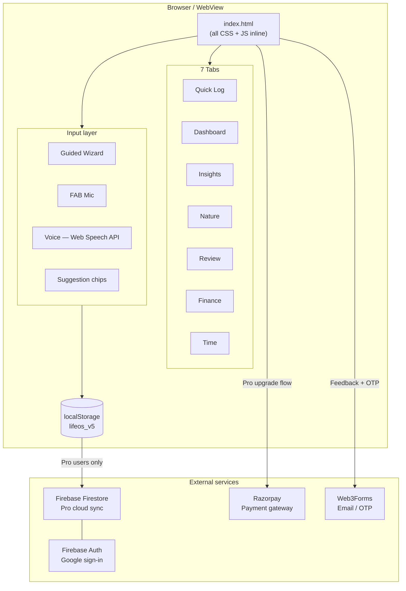
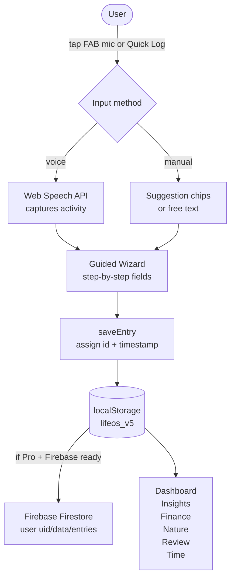

# Flourish — Architecture

## Overview

Flourish is a single-file progressive web app (PWA). There is no framework, no bundler, and no server. Everything — HTML, CSS, and JavaScript — lives in one file (`index.html`). All user data stays on-device in `localStorage` unless the user enables optional Firebase cloud sync via Pro.

---

## Tech stack

| Layer | Technology |
|---|---|
| App | Vanilla HTML / CSS / JS — single file |
| Storage (free) | `localStorage` — key `lifeos_v5` |
| Storage (Pro) | Firebase Firestore v10 (lazy-loaded) |
| Auth (Pro) | Firebase Authentication — Google sign-in |
| Payments | Razorpay (UPI / GPay / cards) |
| Email / OTP | Web3Forms |
| Voice input | Web Speech API (capability-detected at boot) |
| Hosting | GitHub Pages — `flourish.is-a.dev` |
| CI / CD | GitHub Actions |
| Windows package | MSIX (hand-crafted, `makeappx.exe`) |
| Android package | TWA — signed APK + AAB |

---

## Functional architecture

What the app does from the user's perspective:

```
┌─────────────────────────────────────────────────────────────┐
│                     Flourish PWA                            │
│                                                             │
│  ┌──────────┐  ┌───────────┐  ┌──────────┐  ┌──────────┐  │
│  │ Quick Log│  │ Dashboard │  │ Insights │  │  Nature  │  │
│  │          │  │           │  │          │  │          │  │
│  │ • Wizard │  │ • Scores  │  │ • Radar  │  │ • 1-5    │  │
│  │ • Voice  │  │ • Streaks │  │ • Trends │  │  score   │  │
│  │ • Chips  │  │ • Finance │  │ • Season │  │ • Daily  │  │
│  └──────────┘  └───────────┘  └──────────┘  └──────────┘  │
│                                                             │
│  ┌──────────┐  ┌───────────┐  ┌──────────┐                 │
│  │  Review  │  │  Finance  │  │   Time   │                 │
│  │          │  │           │  │          │                 │
│  │ • Weekly │  │ • Income  │  │ • Mode   │                 │
│  │   digest │  │ • Expense │  │   split  │                 │
│  │ • Habits │  │ • Balance │  │ • Focus  │                 │
│  └──────────┘  └───────────┘  └──────────┘                 │
│                                                             │
│  Every tab reads from the same local entry store            │
└─────────────────────────────────────────────────────────────┘
```

---

## Technical architecture

### Component diagram



### Data flow — logging an entry



### Deployment pipeline


---

## Data model

Each entry stored as a JSON object in the `lifeos_v5` array:

```js
{
  id,               // timestamp string
  date,             // "YYYY-MM-DD"
  activity,         // free text
  category,         // inferred or chosen
  duration,         // minutes
  direction,        // "directed" | "distractor"
  mode,             // "doing" | "being" | "social" | "admin" | ...
  friction,         // "low" | "medium" | "high"
  hasFinance,       // bool
  financeType,      // "expense" | "income"
  financeAmount,    // number
  financeCategory,  // string
  natureScore,      // 1–5
  note              // free text
}
```

Firebase path (Pro): `users/{uid}/data/entries` — full array written on each sync.

---

## Secret injection (CI only)

Secrets never touch the source file. The deploy workflow replaces placeholder strings at build time:

```
index.html (source)          GitHub Actions                  index.html (deployed)
─────────────────────────────────────────────────────────────────────────────────
__RAZORPAY_KEY__        →    sed replacement             →   AIza...
__WEB3FORMS_KEY__       →    sed replacement             →   abc123...
__FLOURISH_PRO_KEY__    →    sed replacement             →   passphrase
__FIREBASE_CONFIG__     →    python3 (JSON-safe)         →   {"apiKey":...}
```

---

## Free vs Pro

```
Free (everyone)                     Pro (₹99 founding / ₹100 one-time)
────────────────────────────────    ────────────────────────────────────
All 7 tabs                          Everything in Free
Voice logging                       Cross-device sync — Firebase Firestore
Guided wizard                       Golden premium theme (body.is-pro)
Wisdom stories                      Pro badge in header
Seasonal insights
Finance tracking
Nature score
```

---

## Design tokens

```css
--cb: #1A4A8C   /* brand blue  */    --cg: #1A6B3C   /* green  */
--ca: #B07020   /* amber       */    --cr: #B83020   /* red    */
--cp: #5C2A9D   /* purple      */    --ct: #0F6B6B   /* teal   */
--co: #C06520   /* orange      */
```

Pro mode: `body.is-pro` overrides to warm gold borders and background tints.
